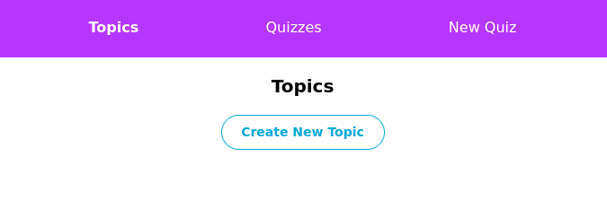
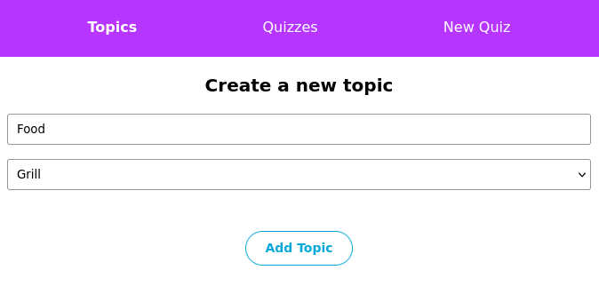
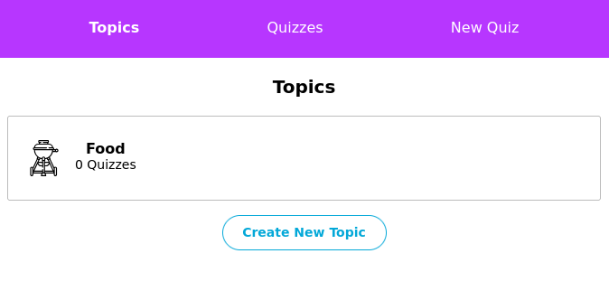
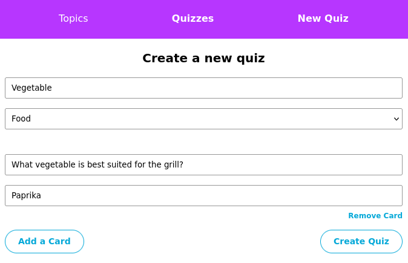
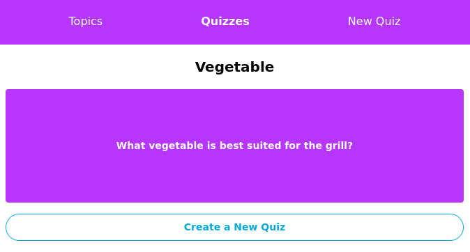

# Flashcards
A React application for creating and managing flashcards organized into topics and quizzes.

## Motivation
Built as a learning project to practice React with Redux Toolkit and React Router. The goal is to understand how to structure state using Redux slices and navigate between views with React Router v6.

## Build status
_Not configured._

## Code style
[](https://github.com/feross/standard)

## Screenshots







## Tech/framework used
<b>Built with</b>

- [React 18](https://react.dev)
- [Redux Toolkit](https://redux-toolkit.js.org)
- [React Redux](https://react-redux.js.org)
- [React Router v6](https://reactrouter.com)
- [Create React App](https://create-react-app.dev)

## Features
- Create topics with an associated icon
- Create quizzes linked to a topic
- Add flashcards (front/back) to a quiz
- Navigate between topics and quizzes
- Global state managed with Redux Toolkit (topics, quizzes, cards)

## Code Example
```js
// Add a topic via Redux action
dispatch(addTopic({ id: '1', name: 'Mathematics', icon: '📐' }));

// Add a quiz linked to a topic
dispatch(addQuiz({ id: '1', name: 'Algebra', topicId: '1', cardIds: [] }));
```

## Installation
```bash
# Clone the repo
git clone <repo-url>
cd flashcards-starting-code-react-v18

# Install dependencies
npm install

# Start the development server
npm start
```

Open [http://localhost:3000](http://localhost:3000) in your browser.

## API Reference

No external APIs are used. State is managed locally via the Redux store with three slices:

| Slice | Actions |
|-------|---------|
| `topicsSlice` | `addTopic` |
| `quizzesSlice` | `addQuiz` |
| `cardsSlice` | `addCard` |

## Tests

_No tests implemented in this project._

## How to use?

1. Navigate to **Topics** and create a new topic with a name and icon
2. Go to **Quizzes** and create a new quiz linked to a topic
3. Add flashcards (front and back) to the quiz
4. Browse quizzes and topics using the navigation

## Contribute

This is a personal learning project and does not accept external contributions.

## Credits

Boilerplate and project structure provided by [Codecademy](https://www.codecademy.com).

## License
This project was built as part of Codecademy learning exercise.
The starter code is property of Codecademy
